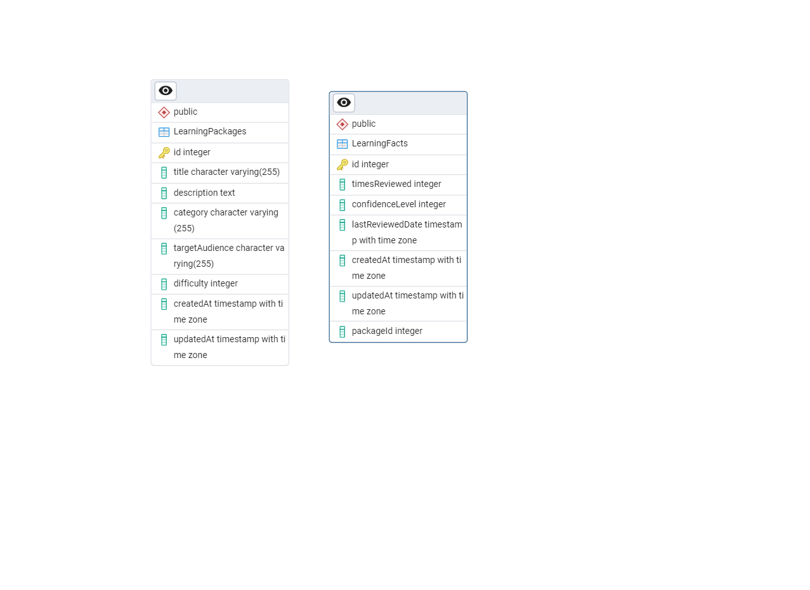

# Backend - Node.js API

## Description

This project serves as the backend part of an application using Node.js and Express to manage Todos and Learning Packages. It also includes Swagger documentation to ease API navigation.

---

## Installation

### Prerequisites
- Node.js
- NPM
- Compatible database PostgreSQL

### Install dependencies
- npm install

---

## Run scripts

### Start the server
npm start

### Database synchronization
npm run sync-db

### Test database connection
npm run test-db

---

## Project Structure

### Key Files and Folders :

>- **`app-todo.ts`** : **Main entry point for the application. It configures the Express server, defines the main routes, and integrates Swagger for API documentation.**

> ***Database files*** 
>- **`database.ts`** : Contains the database connection logic.
>- **`sync-database.ts`** : Synchronizes the models with the database schema.
>- **`test-database.ts`** : Optional file to test the database connection.

> ***Models***
>- **`models/`** : *Includes the TypeScript models used in the application*
>- **`LearningPackage.ts`** : Model representing "Learning Packages".
>- **`LearningFact.ts`** : Model representing "Learning Facts".

> ***Configuration Files***
>- **`package.json`** : Lists dependencies and scripts.
>- **`package-lock.json`** : Dependency resolution details.
>- **`tsconfig.json`** : TypeScript configuration.
>- **`swagger.json`** : Swagger documentation.

---

## Features
- CRUD operations for Todos and Learning Packages.
- Swagger documentation for API navigation.
- Database synchronization with PostgreSQL.

---

## Diagram

---

## Example Request

**Get all learing package :**

> curl -X GET http://localhost:3000/api/package